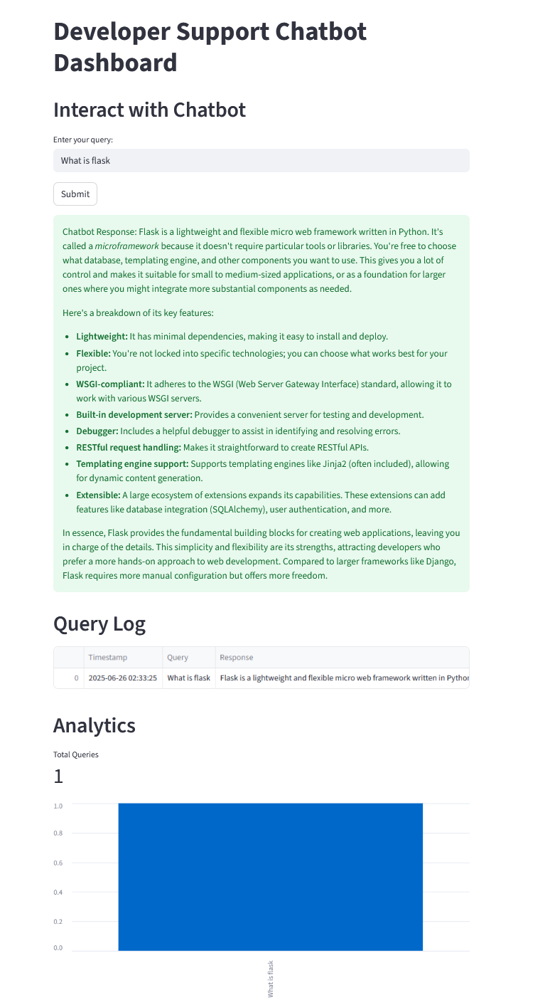
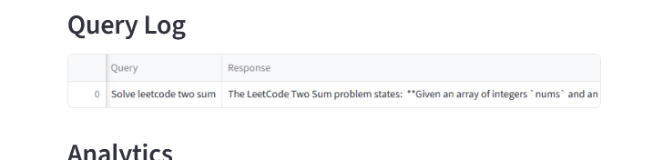
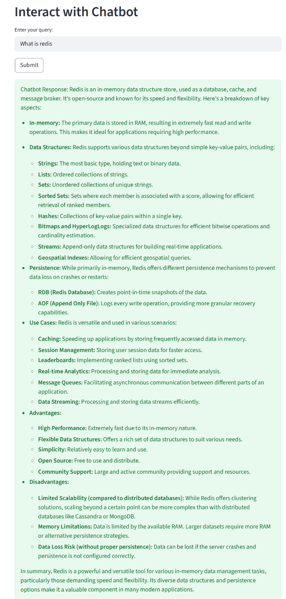

# 🛠️ Developer-Support Chatbot

A lightweight **AI troubleshooting assistant** that answers developer questions, **logs every interaction**, and shows **live analytics** (queries/min, latency over time, top queries). It’s powered by Gemini 2.5, and the UI is optimized for productivity.

<p align="center">
  <a href="https://mediaspace.wisc.edu/media/Dev+Support+Chatbot-+Aagam+Sogani/1_y4izuzl7" target="_blank" rel="noopener noreferrer">
    
  </a>
</p>

---

## ✨ Highlights

* **Natural-language Q\&A** for dev topics (errors, APIs, snippets, best practices)
* **Live analytics**: queries/min, latency over time, top repeated queries
* **Structured logging** to SQLite (WAL mode) for low contention
* **Provider-agnostic** via env vars (OpenAI / Gemini / local Hugging Face)
* **Operability endpoints**: `/health`, `/admin/clear`
* **Drop-in dashboard** (Streamlit) built for clean demos

---

## 🧭 Architecture

| Component                        | Tech                           | Purpose                                                                  |
| -------------------------------- | ------------------------------ | ------------------------------------------------------------------------ |
| **Flask API**                    | Python (auto-detects provider) | `/query` for answers, `/health` for readiness, `/admin/clear` for resets |
| **Streamlit Dashboard**          | Streamlit + pandas             | Live console, **response card**, log table, and analytics                |
| **(Optional) VS Code Extension** | TypeScript (`dist/`)           | In-IDE answers (ships as a self-contained demo build)                    |

> 🔒 **Note:** Repo contains only open-source code and demo assets—no private keys or proprietary data.

---

## 🚀 Quick Start (Two Terminals)

> Works on macOS/Linux/WSL/Windows. Use a virtual env if you’d like.

### 0) Clone & install

```bash
git clone https://github.com/<your-username>/developer-support-chatbot.git
cd developer-support-chatbot

# Core deps (Flask, Streamlit, requests, etc.)
pip install -r requirements.txt

# Provider clients (OpenAI, Google Generative AI, HF extras, etc.)
pip install -r requirements_extra.txt
```

### 1) Set environment (optional but recommended)

```bash
# Choose model provider via env (auto-detects if not set)
# export PROVIDER=openai        # or: gemini | hf

# If using OpenAI:
# export OPENAI_API_KEY=sk-...

# If using Gemini:
# export GOOGLE_API_KEY=...

# Ensure API & dashboard share the same absolute DB path
export CHATBOT_DB="$(pwd)/logs.db"

# (Optional) If you move the API off 5000, let the dashboard know:
# export CHATBOT_API="http://127.0.0.1:5001/query"
# export CHATBOT_HEALTH="http://127.0.0.1:5001/health"
# export CHATBOT_CLEAR="http://127.0.0.1:5001/admin/clear"
```

### 2) Run the API (Terminal #1)

```bash
# Default port 5000
python app_logging_autodetect.py

# OR choose a port explicitly (e.g., if 5000 is busy):
# PORT=5001 python app_logging_autodetect.py
```

### 3) Run the dashboard (Terminal #2)

```bash
# If API is on 5000:
streamlit run dashboard.py --server.port 8501

# If you changed API port, set envs before launching:
# export CHATBOT_API="http://127.0.0.1:5001/query"
# export CHATBOT_HEALTH="http://127.0.0.1:5001/health"
# export CHATBOT_CLEAR="http://127.0.0.1:5001/admin/clear"
# streamlit run dashboard.py --server.port 8501
```

> **Tip:** Use the **“Clear Analytics / History”** button to start a fresh demo session.

---

## 📸 Product Tour

|                                                                                                    |                                                                    |
| -------------------------------------------------------------------------------------------------- | ------------------------------------------------------------------ |
| **1 · Interactive Dashboard** <br>Live console with full-width response card                       | **2 · Query Log** <br>Structured history with timestamps & latency |
|  |     |

|                                                                                     |   |
| ----------------------------------------------------------------------------------- | - |
| **3 · Output (API)** <br>Plain JSON endpoint for programmatic use                   |   |
|  |   |

---

## ⚙️ Environment Variables

| Var              | Example                             | Purpose                                       |
| ---------------- | ----------------------------------- | --------------------------------------------- |
| `PROVIDER`       | `openai` \| `gemini` \| `hf`        | Selects model provider (auto-detect if unset) |
| `GOOGLE_API_KEY` | `...`                               | Required for `PROVIDER=gemini`                |
| `CHATBOT_DB`     | `/abs/path/logs.db`                 | Shared SQLite path used by API & dashboard    |
| `PORT`           | `5001`                              | Port for the Flask API (default `5000`)       |
| `CHATBOT_API`    | `http://127.0.0.1:5000/query`       | Dashboard → API URL                           |
| `CHATBOT_HEALTH` | `http://127.0.0.1:5000/health`      | Dashboard health check                        |
| `CHATBOT_CLEAR`  | `http://127.0.0.1:5000/admin/clear` | Dashboard “Clear DB” action                   |

---

## 🧪 Tutorial Prompts 

* `what is kotlin`
* `write a Python function that returns the nth Fibonacci number iteratively`
* `why does Node.js throw EADDRINUSE and how do I fix it`
* After clearing: `what is a pointer in C`

---

## 🛠️ Troubleshooting

* **“Port 5000 is in use”**
  The API is already running or another app is. Use a different port:
  `PORT=5001 python app_logging_autodetect.py` and update the dashboard envs.

* **Dashboard charts look empty**
  Make sure **both** processes point to the **same absolute** `CHATBOT_DB` path.

* **Answers render strangely (code blocks faded)**
  Use the included dashboard which renders the answer body as **Markdown** (so \`\`\` fences show properly).

---

## 📦 VS Code Extension (optional)

A demo build is included under `dist/`. It shows how to surface API answers in-editor. (Not required for running the API + dashboard experience.)

---

## 📄 License

MIT — do anything, just keep the notice.

---

## 👤 Author

**Aagam Sogani**

* Demo video: **[Watch here ▶](https://mediaspace.wisc.edu/media/Dev+Support+Chatbot-+Aagam+Sogani/1_y4izuzl7)**
* Portfolio & contact available on request.

---

### Why this matters

This project turns support into **data**: what developers ask, **how fast** you respond, and where to **optimize** prompts, caching, or model selection. It’s small, pragmatic, and production-minded—perfect for triage consoles, internal tools, and IDE assistants.
